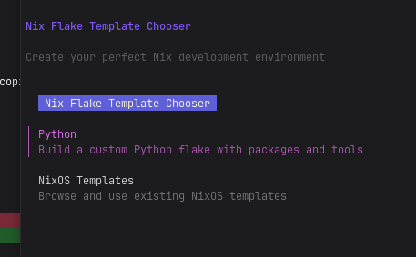
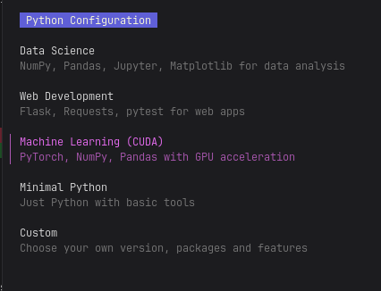
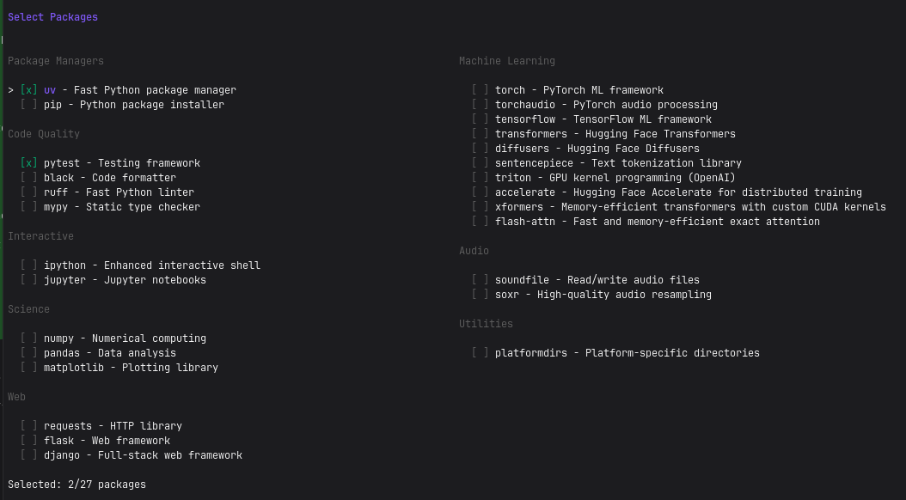
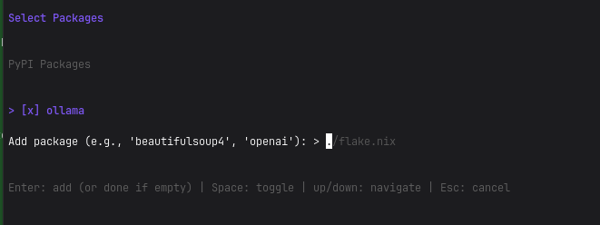
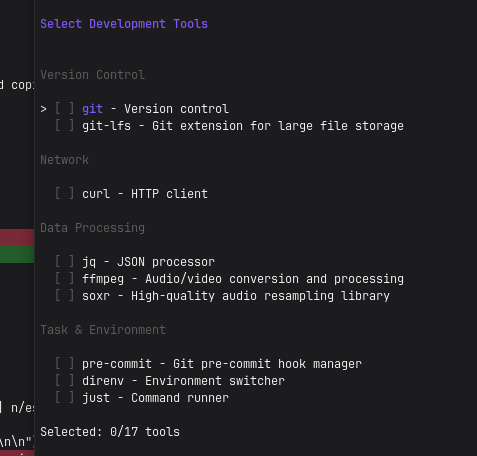
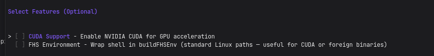

# nix-template-chooser

An interactive TUI for generating `flake.nix` development environments — because nobody wants to look up flake syntax every time they start a new project.

<!-- ANIMATION PLACEHOLDER -->
<!-- Replace the block below with an animated GIF or an asciinema embed -->
> _Demo animation coming soon_
<!-- END ANIMATION PLACEHOLDER -->

---

## TL;DR

**Run without installing:**
```bash
nix run github:mmxgn/manos-nixos-template-builder
# or write flake.nix somewhere specific:
nix run github:mmxgn/manos-nixos-template-builder -- ~/projects/myapp/flake.nix
```

**Install permanently:**
```bash
nix profile install github:mmxgn/manos-nixos-template-builder
nix-template-chooser                          # writes ./flake.nix
nix-template-chooser ~/projects/myapp/flake.nix
nix-template-chooser -o ~/projects/myapp/flake.nix
```

Navigate with arrow keys, `Space` to toggle, `Enter` to confirm, `Esc` to go back, `q` to quit.
A `flake.nix` is written to the target path when you confirm.
If the parent directory doesn't exist, you'll be prompted to create it before the TUI starts.

---

## What it does

### 1. Choose a mode

Pick **Python** for a fully guided custom environment, or **NixOS Templates** to browse and apply an existing template from [github:NixOS/templates](https://github.com/NixOS/templates).



### 2. Pick a preset or go custom

Choose from ready-made presets (Data Science, Web Development, ML+CUDA, …) or build from scratch with **Custom**.



### 3. Select packages

Toggle Python packages grouped by category. The list switches to multiple columns automatically when it doesn't fit on screen.



Press `p` to manage PyPI packages inline — add new ones or deselect existing ones without leaving the screen.



### 4. Select tools

Toggle development tools by category — version control, network utilities, editors, compilers, task runners, and more.



### 5. Enable optional features

Add CUDA support, wrap the shell in a FHS environment for foreign binaries, or both independently.



### 6. Confirm and go

Review your configuration, write `flake.nix`, then optionally drop straight into `nix develop path:.` (`y`) or open the result in `$EDITOR` (`e`).

---

## Full flow (custom mode)

1. **nixpkgs channel** — `nixos-unstable` or a stable release; unsupported Python versions are greyed out automatically
2. **Python version** — picks from versions available in the selected channel
3. **Packages** — toggle nixpkgs packages, add PyPI packages (`p`), environment variables (`e`), or any custom nixpkg (`c`)
4. **Tools** — git, git-lfs, curl, ripgrep, neovim, gcc, pre-commit, …
5. **Features** — CUDA support, FHS environment
6. **Confirm** — review and write `flake.nix`

---

## Requirements

- [Nix](https://nixos.org/download) with flakes enabled (`experimental-features = nix-command flakes` in `nix.conf`)

<details>
<summary><strong>NixOS system flake</strong></summary>

Add the flake as an input and include the package in `environment.systemPackages`:

```nix
# flake.nix
{
  inputs = {
    nixpkgs.url = "github:NixOS/nixpkgs/nixos-unstable";
    nix-template-chooser.url = "github:mmxgn/manos-nixos-template-builder";
  };

  outputs = { nixpkgs, nix-template-chooser, ... }: {
    nixosConfigurations.my-host = nixpkgs.lib.nixosSystem {
      modules = [
        ({ pkgs, system, ... }: {
          environment.systemPackages = [
            nix-template-chooser.packages.${system}.default
          ];
        })
      ];
    };
  };
}
```

</details>

<details>
<summary><strong>Home Manager</strong></summary>

Add the flake as an input and install via `home.packages`:

```nix
# flake.nix
{
  inputs = {
    nixpkgs.url = "github:NixOS/nixpkgs/nixos-unstable";
    home-manager.url = "github:nix-community/home-manager";
    nix-template-chooser.url = "github:mmxgn/manos-nixos-template-builder";
  };

  outputs = { nixpkgs, home-manager, nix-template-chooser, ... }: {
    homeConfigurations.my-user = home-manager.lib.homeManagerConfiguration {
      pkgs = nixpkgs.legacyPackages.x86_64-linux; # adjust for your system
      modules = [
        ({ pkgs, ... }: {
          home.packages = [
            nix-template-chooser.packages.${pkgs.system}.default
          ];
        })
      ];
    };
  };
}
```

</details>

## Why does this exist?

Starting a new project shouldn't mean spending 20 minutes fighting flake syntax before writing a single line of code. This tool remembers the boilerplate so you don't have to.

## But isn't this slop?

Fully, but it's a small price to pay in order to more easily make human-made code on NixOS.
